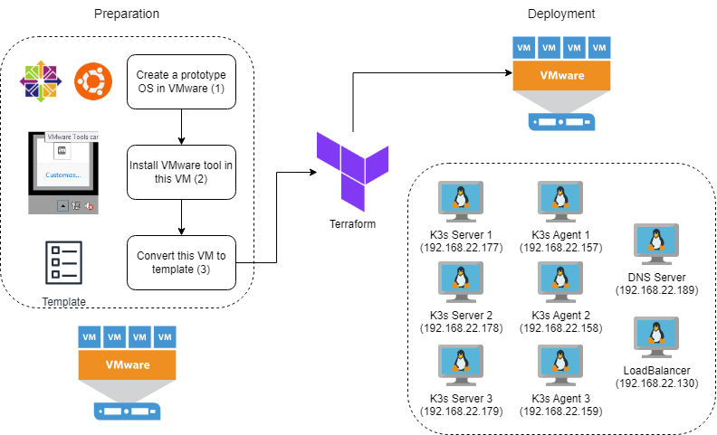

# K3S (Deploy K3s with Embedded database by Terraform in vSphere)

Lightweight [Kubernetes](https://docs.k3s.io/). Easy to install, half the memory, all in a binary of less than 100 MB.

## Preparation
Leverage Terraform to deploy K3S nodes (server and agent) on VMware vSphere follow this Deployment below
<p align="center">
  
</p>

1. Create a prototype OS in VMware
- Using **CentOS 8** for K3s cluster. K3s uses NetworkManager to manage connection in their cluster. From Ubuntu 17.10 and later version, Netplan has been used to manage its network -> **can't use Ubuntu** to install K3s cluster. More information about Operating Systems compatable with K3s in [here](https://docs.k3s.io/installation/requirements#operating-systems).
- Using **Ubuntu 22** for other services (DNS and Loadbalancer) with long-term support
- Create VM with basic resource such as: 1vCPU, 4GB RAM, 25GB thin disk (VMware doesn't allow to narrow the disk)
2. Install VMware tool in this VM
- After creating 2 types of VM with basic resource. Install VMware Tools in each VM to allow cus

## Deployment
To install k3s, you can follow different approaches like setting up k3s with an **external database**, **embedded database**, or as **a single node**.

An HA K3s cluster with embedded etcd is composed of:
- Three **server nodes** that will serve the Kubernetes API and run other control plane services, as well as host the embedded etcd datastore
- Three **agent nodes** that are designated to run your apps and services
- A **fixed registration address** for agent nodes to register with the cluster
<p align="center">
  
</p>

### Install DNS with table
| Name | Status | Record Type | IP Address |
| -------- | -------- | -------- | -------- |
|       | IN | NS | ns.lab.thinhphung.online. |
| nginx | IN | A | 192.168.22.130 |
| k3ss1 | IN | A | 192.168.22.177 |
| k3ss2 | IN | A | 192.168.22.178 |
| k3ss3 | IN | A | 192.168.22.179 |
| k3sa1 | IN | A | 192.168.22.157 |
| k3sa2 | IN | A | 192.168.22.158 |
| k3sa3 | IN | A | 192.168.22.159 |

### Install fixed registration address (for Agent Nodes)
In the high-availability server configuration, each node can also **register with the Kubernetes API by using a fixed registration address**, the registration flow is:
- The agent connects to the supervisor (and kube-apiserver) via the local load-balancer (192.168.22.130) on port 6443
- The load-balancer maintains a list of available endpoints to connect
```
events {
    worker_connections 1024;
}

stream {
  upstream k3sserver {
    server k3ss1.lab.thinhphung.online:6443;
    server k3ss2.lab.thinhphung.online:6443;
    server k3ss3.lab.thinhphung.online:6443;
  }

  server {
    listen              6443;
    proxy_pass          k3sserver; 
  }
}
```
- Once it connects to the cluster, the agent retrieves a list of kube-apiserver addresses list in the default namespace
- A connection to the kube-apiserver that tolerates outages of individual servers will be established

In this lab, I use nginx load balancer (192.168.22.130) as a Fixed Registration Address
<p align="center">
  
</p>

### Install Server
To get started, first launch a server node with the <code>cluster-init</code> flag to enable clustering and a token that will be used as a shared secret to join additional servers to the cluster.
```
curl -sfL https://get.k3s.io | sh -s - server \
  --token=GsdfkE1Dejwp \            (This token like a password for joining cluster)
  --tls-san nginx.lab.thinhphung.online \
  --tls-san 192.168.22.130 \        (Fixed Registration Address)
  --cluster-init
```
After launching the first server, join the second and third servers to the cluster using the shared secret:
```
curl -sfL https://get.k3s.io | sh -s - server \
  --token=GsdfkE1Dejwp \
  --tls-san nginx.lab.thinhphung.online \
  --tls-san 192.168.22.130 \                            (Fixed Registration Address)
  --server https://k3ss1.lab.thinhphung.online:6443     (A server Node installed K3s)
```
### Cluster Access
The kubeconfig file stored at <code>/etc/rancher/k3s/k3s.yaml</code> is used to configure access to the Kubernetes cluster

Copy <code>/etc/rancher/k3s/k3s.yaml</code> on your machine located *outside the cluster* as <code>~/.kube/config</code>. Then replace the value of the <code>server</code> field with the IP or name of your K3s server. <code>kubectl</code> can now manage your K3s cluster

### Check K3s Cluster
After config the machine located outside the cluster to access K3s. Check to see that the second and third servers are now part of the cluster:
```
kubectl get nodes
```
Now you have a highly available control plane. Any successfully clustered servers can be used in the --server argument to join additional server and agent nodes. Joining additional agent nodes to the cluster follows the same procedure as servers:
```
curl -sfL https://get.k3s.io | sh -s - agent \
  --token=GsdfkE1Dejwp \                (token have to be the same with server's token)
  --server https://192.168.22.130:6443  (Fixed Registration Address)
```

<p align="center">
  
</p>
<p align="center">
  <em>K3s High Availability</em>
</p>

## Maintenance
Some basic concepts of K8s in this lab:
- Workloads
  - Deployment: Provides declarative updates for Pods and ReplicaSets. More information [here](https://kubernetes.io/docs/concepts/workloads/controllers/deployment/)
  - ReplicaSet: Ensures that *a specified number of pod* replicas are running at any given time. However, a *Deployment is a higher-level* concept that manages ReplicaSets. More information [here](https://kubernetes.io/docs/concepts/workloads/controllers/replicaset/)
  <p align="center">
    
  </p>
  <p align="center">
    <em>K3s Deployment</em>
  </p>
  - DeamonSet: Ensures that *all (or some) Nodes run a copy of a Pod*. As nodes are removed from the cluster, those Pods are garbage collected. *Deleting a DaemonSet will clean up the Pods it created*. More information [here](https://kubernetes.io/docs/concepts/workloads/controllers/daemonset/)
  <p align="center">
    
  </p>
  <p align="center">
    <em>K3s ingress service</em>
  </p>

- Services, Load Balancing, and Networking
  - Service: It is a method for *exposing one or more Pods* in your cluster. More information [here](https://kubernetes.io/docs/concepts/services-networking/service/)
  - Ingress: An *API object* that manages *external access to the services* in a cluster, *typically HTTP*. More information [here](https://kubernetes.io/docs/concepts/services-networking/ingress/)
  <p align="center">
    
  </p>
  <p align="center">
    <em>K3s ingress service</em>
  </p>

Overall Data workflow in K3s
<p align="center">
  
</p>
<p align="center">
  <em>K3s Traffic Flow</em>
</p>

<p align="center">
  
</p>
<p align="center">
  <em>K3s User Traffic Flow</em>
</p>

<p align="center">
  
</p>
<p align="center">
  <em>K3s External Traffic Flow</em>
</p>

## Code


## Bonus
### K3s Networking
1. [Traefik Ingress controller](https://docs.k3s.io/networking#traefik-ingress-controller) - internal Load balancer
- It is a LoadBalancer layer 7
- The Traefik ingress controller deploys a LoadBalancer Service that uses ports 80 and 443
- The default config file is found in <code>/var/lib/rancher/k3s/server/manifests/traefik.yaml</code>.
- By default, Traefik dashboard is enabled (--api.dashboard=true in Arguments). If you want to expose Treafik dashboard, you can use <code>traefik-dashboard-service.yml</code> and <code>traefik-dashboard-ingress.yml</code> files in *Code/k3s*
- [Labels](https://doc.traefik.io/traefik/routing/routers/)
  - Host: Specify *a particular hostname (or domain)* as a condition for routing incoming requests to a specific backend service. Example: <code>```traefik.http.routers.nginx2.rule=Host(`ns.lab.thinhphung.online`)```</code>
  - HostRegexp: It is an *advanced routing rule* in Traefik that allows you to *use regular expressions* to match hostnames and route traffic accordingly. Example: <code>```traefik.http.routers.nginx1.rule=HostRegexp(`{subdomain:[a-zA-Z0-9-]+}.lab.thinhphung.online`) && PathPrefix(`/`)```</code>

2. [Nginx](https://docs.nginx.com/nginx/admin-guide/load-balancer/tcp-udp-load-balancer/) - external Load balancer
- It is a LoadBalancer layer 4
- *Forward TCP connections or UDP datagrams* from clients to an upstream group or a proxied server
- There are 5 load-balancing methods supported:
  - Round Robin - *By default*, directing requests sequentially to the servers
  - [Least Connections](https://nginx.org/en/docs/stream/ngx_stream_upstream_module.html#least_conn) - Selects the server with the smaller *number of current active connections*
  - [Least Time](https://nginx.org/en/docs/stream/ngx_stream_upstream_module.html#least_time) - NGINX Plus only
  - [Hash](https://nginx.org/en/docs/stream/ngx_stream_upstream_module.html#hash) - *Based on client IP address*, connections from a given client are always passed to the same server unless the server is down or otherwise unavailable
  - [Random](https://nginx.org/en/docs/stream/ngx_stream_upstream_module.html#random) - NGINX randomly selects two servers taking into account *server weights*, and then chooses one of these servers *using the specified method*
